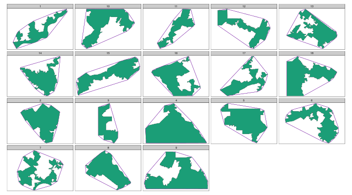
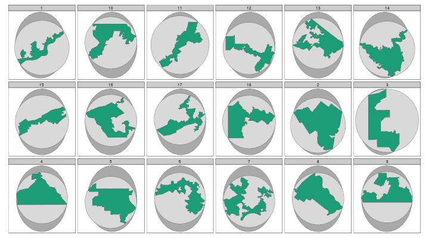

# compactr

Compactness scores in R for district shapes

Package dependencies:

* sf
* lwgeom (for Minimum Bounding Circle)

## Shape index compactness measures

A shape index expresses a ratio of area to perimeter. It is scaled
so that the most compact shape, a circle, has a score of 1,
with less compact shapes declining toward 0. Two commonly used measures
are Polsby-Popper and Schwartzberg. Polsby-Popper is conceptualized as the
ratio of the area of the district to the area of a circle with an equal
circumference. It is calculated as:

<!--\deqn{\frac{4 \pi Area }{Perimeter^{2} } }-->

Schwartzberg is conceptualized as the ratio of the perimeter of the district
to the circumference of a circle with an equal area. Although the formula
is usually expressed distinctly, it is equivalent to the square root of
Polsby-Popper, and that is how it is calculated in this function.

Shape indexes will be lower for
"skinny" shapes, those that are wider in one direction than another. The
score will also be lower for more convoluted perimters. The score is
therefore impacted by the coastline paradox, and will also vary with the
degree of generalization of the input data, i.e. more highly generalized
(smoother) polygons will produce higher compactness scores.

For lat-long coordinates, this function relies upon the behavior of
`st_area` and `st_length`, which will calculate geodetic areas and lengths.

## Area-based compactness measures

Compactness may be expressed as the ratio of the area of a shape to the
area of some larger, enclosing shape. Two common measures are the
Minimum Convex Polygon and the Reock scores. Minimum Convex Polygon is the
ratio of the area of a shape to its convex hull. Reock is the ratio of the
area of a shape to its minimum bounding circle.

If the tested polygon is strictly convex, the area of the shape and its
convex hull will be equal and `area_convex_hull` will return 1. As the
minimum bounding circle always contains the convex hull, the Reock score
must be smaller than the Minimum Convex Polygon score, unless the shape is
a circle, in which case both scores will equal 1. For certain shapes, the
scores will diverge wildly. An eccentric but convex or nearly convex shape,
such as a cigar, will have a high (1 or near 1) Minimum Convex Polygon score
but a low (< 0.1) Reock score.

Convex Hulls and Minimum Bounding Circles should be created in a projected
coordinate system using a conformal projection. In practice, creating
convex hulls in geographic (lat-long) coordinate systems will introduce
minimal errors:

Calculating Reock, which relies on Minimum Bounding Circles,
will be widly incorrect, and the direction of the error is unpredictable:

|District_N | reock_equal_area| reock_mercator| merc_ea_diff| reock_lat_long| gcs_ea_diff|
|:----------|----------------:|--------------:|------------:|--------------:|-----------:|
|1          |            0.149|          0.149|        0.000|          0.133|      -0.016|
|2          |            0.532|          0.532|        0.000|          0.483|      -0.049|
|3          |            0.309|          0.308|       -0.001|          0.377|       0.067|
|4          |            0.431|          0.432|        0.001|          0.340|      -0.091|
|5          |            0.442|          0.443|        0.001|          0.362|      -0.079|
|6          |            0.298|          0.299|        0.001|          0.235|      -0.063|
|7          |            0.332|          0.332|        0.000|          0.267|      -0.065|
|8          |            0.415|          0.416|        0.001|          0.335|      -0.080|
|9          |            0.360|          0.362|        0.002|          0.282|      -0.078|
|10         |            0.324|          0.327|        0.003|          0.264|      -0.059|
|11         |            0.197|          0.198|        0.001|          0.203|       0.006|
|12         |            0.229|          0.228|       -0.001|          0.187|      -0.042|
|13         |            0.337|          0.338|        0.000|          0.260|      -0.077|
|14         |            0.343|          0.342|        0.000|          0.319|      -0.024|
|15         |            0.191|          0.191|        0.000|          0.164|      -0.027|
|16         |            0.360|          0.360|        0.000|          0.289|      -0.071|
|17         |            0.241|          0.241|       -0.001|          0.193|      -0.048|
|18         |            0.360|          0.361|        0.001|          0.304|      -0.056|

The values are calculated with the following projections:

* `reock_equal_area` uses the locally parameterized Albers equal area projection used by Pennsylvania's Department of Environmental Projection. For this comparison, this will be treated as the most accurate projection.
* `reock_mercator` uses World Mercator based on the WGS84 datum.
* `reock_lat_long` uses plate carrée, i.e. treats latitude and longitude as Cartesian coordinates. Redistricting data are provided by the US Census in a lat-long coordinate system, and some analysts appear to be calculating compactness measures without reprojection.

Although distortions will increase over larger areas and at high latitudes, the error introduced by using World Mercator (fourth column) is small. The error introduced by using lat-long (final column) ranges from -0.091 to +0.067 on the 0 to 1 Reock scale.
